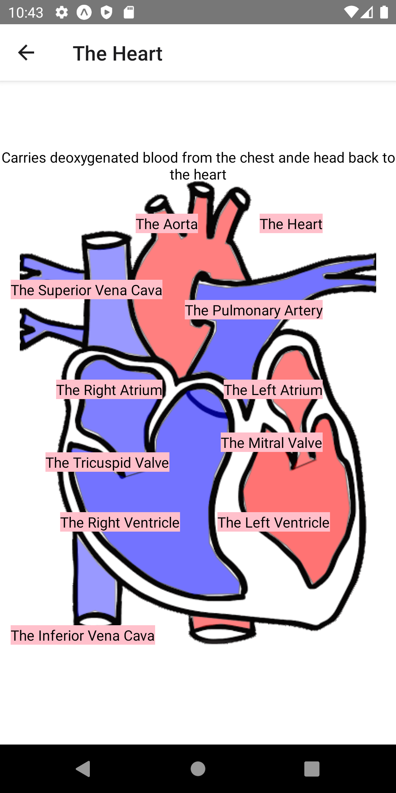

# Child Body Atlas
This is a project for IT-280B.

This app is designed to be a learning tool for late elementary or early middle school students. 

Currently, the app consists of a main screen, and four main parts- the interior and exterior of the brain, a neuron and the heart. It could easily be expanded. 

<h1>Interface Examples</h1>
<h2>The welcome page</h2>

<h2>The Brain Exterior</h2>

<h2>The Brain Interior</h2>

<h2>The Neuron</h2>

<h2>The Neuron</h2>

<h2>The Heart</h2>

